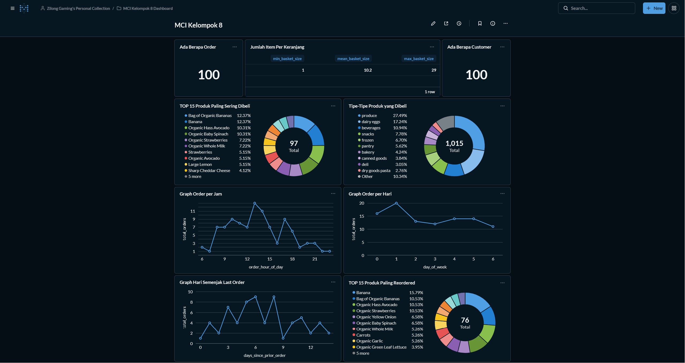

# MCI2026_Task2_Kelompok8

Arvito Rajapandya Natlysandro - 5054241046
Umar Al Faris - 5054241015

### Membuat Visualisasi & Questions di Metabase
 Setelah terimpor, kita menggunakan Metabase untuk mendapatkan visualisasi dan menemukan trend, saya dan rekan saya menemukan 9 pola yang menurut kami menarik
 - Ada Berapa Customer

 Menunjukan pada database ada Berapa Customer (melihat berdasarkan ID)

 - Ada Berapa Order

 Menunjukan Order ada berapa saja (1 customer bisa banyak order)
 - Graph Hari Semenjak Last Order

 Graph Order Per Hari/ Per Jam

 Graph berdasarkan berapa banyak yang dibeli

 - Tipe produk yang dibeli 

Kita mengetahui section apa yang dibeli
Trend Produk
- 
    Produk dibeli berulang kali (cyclical)
    
Produk sering dibeli
- 
Tren produk yang dibeli

### Membangun Dashboard di Metabase

